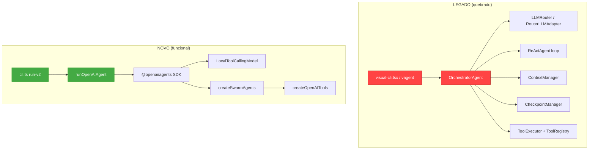
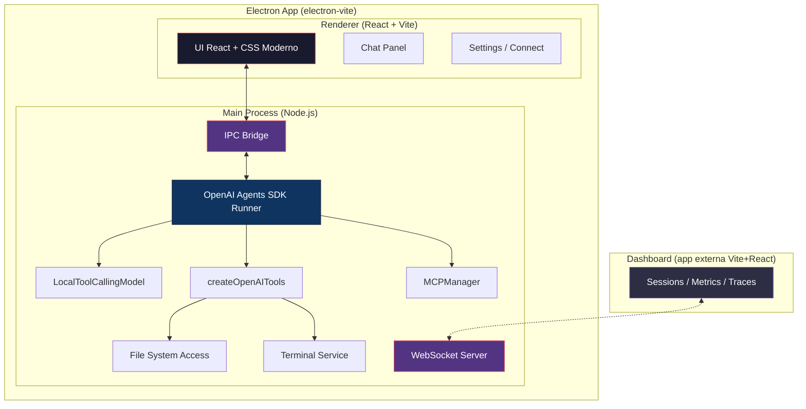
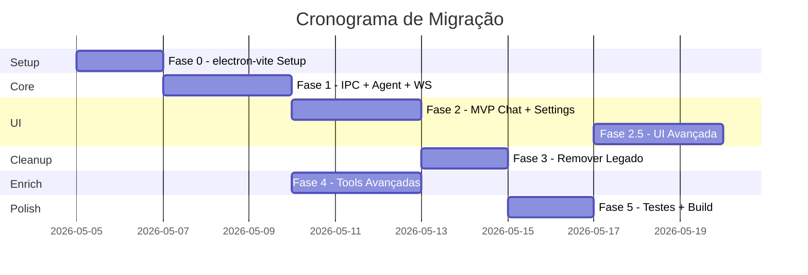

# Plano de Migração: vagent → Electron + OpenAI Agents SDK

## 1. Diagnóstico do Estado Atual

### 1.1 O que está quebrado no `vagent`

O `vagent` ([visual-cli.tsx](file:///c:/Users/Admin/wk/bflow-agent-llm/src/visual-cli.tsx)) é uma TUI construída com **Ink** (React para terminal) que depende do **orquestrador legado** (`OrchestratorAgent`). Os problemas:

| Problema | Causa |
|----------|-------|
| O vagent não roda / crashes | Depende de `OrchestratorAgent` que usa o stack legado (LLMRouter, RouterLLMAdapter, ReActAgent) — enquanto o foco migrou para `@openai/agents` SDK |
| TUI Ink limitada | Terminal não permite UI rica — sem diffs visuais, sem markdown renderizado, sem painéis divididos |
| Dois fluxos paralelos | `run-v2` usa o OpenAI Agents SDK, mas o vagent usa o stack antigo. Manutenção duplicada |
| Dashboard separado | [dashboard/](file:///c:/Users/Admin/wk/bflow-agent-llm/dashboard) é uma app Vite+React separada que precisa de server HTTP — não integrada |

### 1.2 Dois Stacks em Paralelo



---

## 2. Arquitetura Alvo (Electron + OpenAI Agents SDK)

> [!NOTE]
> **Framework escolhido: `electron-vite`** — Vite-based, mais moderno, e alinhado com o tooling do dashboard existente.



### Princípios

1. **Single Stack**: OpenAI Agents SDK (`@openai/agents`) como único runtime de agente
2. **Electron-only**: Toda interação com o agente via Electron — sem CLI headless
3. **Dashboard externo**: O dashboard Vite+React continua como app separada para monitoramento do que acontece no Electron/Agent (via WebSocket)
4. **IPC typed**: Comunicação main↔renderer via canais tipados
5. **Offline-first**: Modelos locais (Ollama/LM Studio) como padrão
6. **MVP-first**: UI mínima funcional (Chat + Settings) → depois iterar com diff viewer, mais painéis, etc.

---

## 3. Inventário: Manter / Migrar / Remover

### ✅ MANTER (core que funciona com o SDK)

| Módulo | Path | Justificativa |
|--------|------|---------------|
| OpenAI Agents orchestrator | [src/agent/openai-agents/](file:///c:/Users/Admin/wk/bflow-agent-llm/src/agent/openai-agents) | Core funcional: `runOpenAIAgent`, `LocalToolCallingModel`, `createSwarmAgents`, `createOpenAITools` |
| Code services | [src/code/](file:///c:/Users/Admin/wk/bflow-agent-llm/src/code) | `editing-service.ts`, `tree-sitter-parser.ts`, `ast-grep-service.ts`, `typescript-language-service.ts`, `terminal-service.ts` — usados pelas tools |
| RAG local | [src/rag/](file:///c:/Users/Admin/wk/bflow-agent-llm/src/rag) | `local-rag.ts`, `lancedb-store.ts`, `embeddings.ts` — podem ser integrados nas tools |
| Observability | [src/observability/](file:///c:/Users/Admin/wk/bflow-agent-llm/src/observability) | `logger.ts`, `tracing.ts`, `dashboard-service.ts` — tracing e logs |
| MCP Server | [src/mcp-server/](file:///c:/Users/Admin/wk/bflow-agent-llm/src/mcp-server) | Server MCP do SaaS (7 tools) |
| MCP Manager | [src/mcp/mcp-manager.ts](file:///c:/Users/Admin/wk/bflow-agent-llm/src/mcp/mcp-manager.ts) | Gerencia conexões MCP Client (stdio/sse) — **deve funcionar** no Electron para conectar a servers externos |
| MCP Connectors | [src/mcp-connectors/](file:///c:/Users/Admin/wk/bflow-agent-llm/src/mcp-connectors) | Conectores para serviços externos |
| Utils | [src/utils/](file:///c:/Users/Admin/wk/bflow-agent-llm/src/utils) | `config.ts`, `env.ts`, `risk-engine.ts`, `security-hooks.ts`, etc. |
| Types | [src/types/](file:///c:/Users/Admin/wk/bflow-agent-llm/src/types) | Definições de tipo centrais |

### 🔄 MIGRAR (adaptar para nova arquitetura)

| Módulo | Path | O que fazer |
|--------|------|-------------|
| Dashboard UI | [dashboard/src/](file:///c:/Users/Admin/wk/bflow-agent-llm/dashboard/src) | **Manter fora do Electron** como app standalone. Adicionar WebSocket client para receber eventos em tempo real do Electron main process |
| CLI `run-v2` | [src/cli.ts](file:///c:/Users/Admin/wk/bflow-agent-llm/src/cli.ts) L163-L221 | Extrair lógica de setup para módulo `core/agent-runner.ts` reutilizável (usado pelo main process do Electron) |
| Config/Connect | [src/cli/repl.ts](file:///c:/Users/Admin/wk/bflow-agent-llm/src/cli/repl.ts) | Lógica de `/connect` vira tela de Settings no Electron |
| Server HTTP | [src/server.ts](file:///c:/Users/Admin/wk/bflow-agent-llm/src/server.ts) | API REST migra para IPC handlers. **Manter WebSocket server** no main process para alimentar o dashboard externo |
| MCP Manager | [src/mcp/mcp-manager.ts](file:///c:/Users/Admin/wk/bflow-agent-llm/src/mcp/mcp-manager.ts) | Validar que funciona no contexto Electron (child_process stdio + SSE). Integrar com IPC para expor status de conexões na UI |

### 🗑️ REMOVER (não faz mais sentido com SDK)

| Módulo | Path | Motivo da remoção |
|--------|------|-------------------|
| **visual-cli.tsx** (vagent) | [src/visual-cli.tsx](file:///c:/Users/Admin/wk/bflow-agent-llm/src/visual-cli.tsx) | Substituído pela UI Electron |
| **App.tsx** (Ink TUI) | [src/ui/App.tsx](file:///c:/Users/Admin/wk/bflow-agent-llm/src/ui/App.tsx) | TUI Ink → React no Electron |
| **OrchestratorAgent** (legado) | [src/agent/orchestrator.ts](file:///c:/Users/Admin/wk/bflow-agent-llm/src/agent/orchestrator.ts) (34KB) | Substituído por `@openai/agents` Runner |
| **ReActAgent** (loop legado) | [src/agent/react-loop.ts](file:///c:/Users/Admin/wk/bflow-agent-llm/src/agent/react-loop.ts) (32KB) | Loop ReAct manual → SDK lida com isso |
| **LLMRouter / RouterLLMAdapter** | [src/llm/router.ts](file:///c:/Users/Admin/wk/bflow-agent-llm/src/llm/router.ts) | Routing manual → SDK usa `ModelProvider` |
| **LLM Adapter legado** | [src/llm/adapter.ts](file:///c:/Users/Admin/wk/bflow-agent-llm/src/llm/adapter.ts) | Substituído por `LocalToolCallingModel` |
| **LLM Providers legado** | [src/llm/providers.ts](file:///c:/Users/Admin/wk/bflow-agent-llm/src/llm/providers.ts) | SDK usa OpenAI client direto — providers viram config de `baseUrl` |
| **ToolRegistry** (legado) | [src/tools/registry.ts](file:///c:/Users/Admin/wk/bflow-agent-llm/src/tools/registry.ts) | SDK tem seu próprio sistema de tools com `tool()` |
| **ToolExecutor** (legado) | [src/tools/executor.ts](file:///c:/Users/Admin/wk/bflow-agent-llm/src/tools/executor.ts) | SDK executa tools internamente |
| **development-tools.ts** (legado) | [src/tools/development-tools.ts](file:///c:/Users/Admin/wk/bflow-agent-llm/src/tools/development-tools.ts) (37KB) | Substituído por `createOpenAITools` em `openai-agents/tools.ts` |
| **ToolSchema builder** (legado) | [src/tools/schema.ts](file:///c:/Users/Admin/wk/bflow-agent-llm/src/tools/schema.ts) | SDK usa Zod para schemas |
| **FeedbackLoop** (legado) | [src/agent/feedback-loop.ts](file:///c:/Users/Admin/wk/bflow-agent-llm/src/agent/feedback-loop.ts) | Lógica de retry manual — SDK tem seus próprios mecanismos |
| **PlanningAgent** (legado) | [src/agent/planning.ts](file:///c:/Users/Admin/wk/bflow-agent-llm/src/agent/planning.ts) | Multi-agent via SDK `handoff()` |
| **ResearchAgent** (legado) | [src/agent/research.ts](file:///c:/Users/Admin/wk/bflow-agent-llm/src/agent/research.ts) | Multi-agent via SDK `handoff()` |
| **CodeReviewAgent** (legado) | [src/agent/code-review.ts](file:///c:/Users/Admin/wk/bflow-agent-llm/src/agent/code-review.ts) | Multi-agent via SDK |
| **RalphLoop** (legado) | [src/agent/ralph-loop.ts](file:///c:/Users/Admin/wk/bflow-agent-llm/src/agent/ralph-loop.ts) | Iteração autônoma — vira guardrail no SDK |
| **HookService** (legado) | [src/agent/hook-service.ts](file:///c:/Users/Admin/wk/bflow-agent-llm/src/agent/hook-service.ts) | Pre/post hooks — SDK tem `onToolStart`/`onToolEnd` |
| **StateMachine** (legado) | [src/state/machine.ts](file:///c:/Users/Admin/wk/bflow-agent-llm/src/state/machine.ts) | SDK gerencia estado do runner |
| **CheckpointManager** (legado) | [src/state/checkpoint.ts](file:///c:/Users/Admin/wk/bflow-agent-llm/src/state/checkpoint.ts) | Checkpoint manual → persistência mais simples via Electron |
| **ExperienceManager** (legado) | [src/state/experience-manager.ts](file:///c:/Users/Admin/wk/bflow-agent-llm/src/state/experience-manager.ts) | Pode ser re-implementado mais simples |
| **ContextManager** (legado) | [src/context/manager.ts](file:///c:/Users/Admin/wk/bflow-agent-llm/src/context/manager.ts) | Compressão de contexto manual — SDK gerencia contexto + modelo local trunca |
| **PromptLibrary** (legado) | [src/prompts/](file:///c:/Users/Admin/wk/bflow-agent-llm/src/prompts) | Prompts de agentes especializados legados — vira `instructions` nos agentes do SDK |
| **Ink / ink-spinner / ink-text-input** | deps no package.json | Removidas — React do Electron substitui |
| **Commander** | dep no package.json | Removido — tudo via Electron, sem CLI |
| **picocolors** | dep no package.json | Removido — sem output de terminal direto |

> [!IMPORTANT]
> Antes de remover qualquer módulo, verificar se há lógica valiosa que precisa ser portada para o novo stack (ex: `listFiles()` e `searchText()` de `development-tools.ts` já foram portados para `openai-agents/tools.ts`).

---

## 4. Fases de Execução

### Fase 0 — Setup electron-vite (1-2 dias)

- [x] Inicializar projeto com `electron-vite` no diretório raiz
  ```bash
  npx @quick-start/create-electron@latest electron-app --template react-ts
  ```
- [x] Estrutura de pastas alvo:
  ```
  bflow-agent-llm/
  ├── electron-app/        # Electron (electron-vite)
  │   ├── src/main/        # Main process
  │   │   └── index.ts     # Main entry (window, IPC stubs)
  │   ├── src/preload/     # Preload (typed API bridge)
  │   │   ├── index.ts
  │   │   └── index.d.ts
  │   ├── src/renderer/    # Renderer (React)
  │   │   ├── index.html
  │   │   └── src/
  │   │       ├── App.tsx  # MVP chat UI
  │   │       ├── main.tsx
  │   │       └── assets/main.css  # Design system
  │   ├── electron.vite.config.ts
  │   ├── electron-builder.yml
  │   └── package.json
  ├── core/                # Agent core (fase 1 — renomear src/)
  ├── dashboard/           # MANTER como app externa
  └── package.json         # Root workspace
  ```
- [x] Configurar build com `electron-builder` (via electron-vite built-in)
- [ ] Testar `electron-rebuild` para dependências nativas (tree-sitter, lancedb) *(adiado para Fase 1 quando core/ for integrado)*
- [ ] Configurar monorepo workspace (`npm workspaces`) se necessário para compartilhar `core/` *(adiado para Fase 1)*

> [!WARNING]
> `tree-sitter` e `@lancedb/lancedb` são módulos nativos. Precisam ser compilados para a versão do Electron (rebuild com `electron-rebuild`).

### Fase 1 — IPC Bridge + Agent Core + WebSocket (2-3 dias)

- [x] Criar módulo `core/agent-runner.ts` que encapsula `runOpenAIAgent` com interface limpa:
  ```typescript
  interface AgentRunConfig {
    task: string;
    workspaceRoot: string;
    model: string;
    baseUrl: string;
    maxTurns: number;
  }
  
  interface AgentEvent {
    type: 'thinking' | 'tool_call' | 'tool_result' | 'message' | 'error' | 'complete';
    content: string;
    metadata?: Record<string, any>;
  }
  
  function runAgent(config: AgentRunConfig): AsyncIterable<AgentEvent>;
  ```
- [x] Criar IPC channels tipados:
  - `agent:run` — inicia uma tarefa
  - `agent:stop` — para execução
  - `agent:event` — stream de eventos main→renderer
  - `config:load` / `config:save` — configuração
  - `workspace:open` — selecionar workspace
  - `mcp:status` / `mcp:connect` / `mcp:disconnect` — gerenciamento MCP *(parcial)*
- [x] Registrar IPC handlers no main process
- [x] Criar hook `useAgent()` no renderer para consumir eventos *(usado diretamente no useEffect do App.tsx)*
- [x] **WebSocket server no main process** (porta configurável, ex: 3030):
  - Broadcast de todos os `AgentEvent` para o dashboard externo
  - Endpoints para sessões, métricas, traces (migrar de `server.ts`) *(base feita)*
  - Dashboard externo conecta via `ws://localhost:3030` para acompanhar tudo em tempo real
- [x] Validar `MCPManager` no contexto Electron:
  - Testar conexão stdio (child_process) e SSE *(processo Main é node, funciona normalmente)*
  - Expor status de conexões MCP via IPC para a UI *(parcial)*

### Fase 2 — UI React Mínima no Electron (2-3 dias)

**MVP (escopo inicial)**:
- [x] Design system base (CSS variables, Google Fonts, dark theme premium)
- [x] **Chat Panel**: input de mensagem + bolhas de conversa com markdown renderizado
- [x] **Settings/Connect**: configuração de provider (Ollama/LM Studio), modelo, baseUrl, API keys
- [x] **Status Bar**: modelo ativo, tokens consumidos, workspace selecionado, status MCP

**Iteração posterior (Fase 2.5 — após MVP rodar)**:
- [x] **Tool Activity**: painel lateral mostrando tool calls em tempo real
- [x] **Diff Viewer**: visualização de mudanças de código (usar `react-diff-viewer` ou Monaco)
- [x] **MCP Panel**: status de conexões MCP, conectar/desconectar servers (layout via UI, falta aprofundar lógica core)
- [x] **File Explorer**: mini-explorer do workspace com arquivos tocados pelo agente

> [!TIP]
> O dashboard de monitoramento (sessions, metrics, traces) **permanece como app externa** em `dashboard/`. Não duplicar essa funcionalidade no Electron — o dashboard é para observar o agente de fora.

### Fase 3 — Eliminar Stack Legado (1-2 dias)

- [x] Remover arquivos listados na seção "REMOVER":
  - `src/visual-cli.tsx`
  - `src/ui/App.tsx`
  - `src/agent/orchestrator.ts`
  - `src/agent/react-loop.ts`
  - `src/agent/feedback-loop.ts`
  - `src/agent/planning.ts`
  - `src/agent/research.ts`
  - `src/agent/code-review.ts`
  - `src/agent/ralph-loop.ts`
  - `src/agent/hook-service.ts`
  - `src/llm/router.ts`
  - `src/llm/adapter.ts`
  - `src/llm/providers.ts`
  - `src/tools/registry.ts`
  - `src/tools/executor.ts`
  - `src/tools/development-tools.ts`
  - `src/tools/schema.ts`
  - `src/state/machine.ts`
  - `src/state/checkpoint.ts`
  - `src/state/experience-manager.ts`
  - `src/context/manager.ts`
  - `src/prompts/library.ts`
  - `src/prompts/specialized.ts`
  - `src/cli/repl.ts` (lógica migrada para Settings UI)
  - `src/cli/init.ts` (init automático no Electron)
  - `src/cli.ts` (entry point CLI — removido, tudo via Electron)
  - `src/server.ts` (server HTTP — WebSocket migra para main process, REST removido)
  - `src/index.ts` (exports legados — recriar com novo core)
- [x] Remover deps não mais usadas do `package.json`:
  - `ink`, `ink-spinner`, `ink-text-input`
  - `commander` (sem CLI)
  - `picocolors` (sem CLI)
- [x] Recriar `core/index.ts` para exportar apenas módulos do novo core
- [x] Limpar `package.json` scripts: remover `vagent`, `vagent:*`, `agent:*`, `dev`, `agent`
- [x] Atualizar `tsconfig.json` para nova estrutura de pastas
- [x] Atualizar `dashboard/` para conectar via WebSocket ao Electron main process em vez de HTTP API

### Fase 4 — Enriquecer Tools no SDK (2-3 dias)

- [x] Portar ferramentas avançadas que só existiam no legado para `openai-agents/tools.ts`:
  - `retrieve_context` (RAG) → nova tool usando `LocalRagService`
  - `rename_symbol` → tool usando `TypeScriptLanguageService`
  - `find_references` → tool usando TS LS
  - `run_tests` → tool usando `TerminalService` com detecção de framework
  - `run_linter` → tool para ESLint/Prettier
  - `git_commit` → tool com validação
- [x] Criar agentes especializados via SDK `Agent` + `handoff()`:
  - Agent de "Planning/Research" focado apenas em RAG e busca
  - Agent de "Code Review" focado apenas em rodar TS Language Service e Lint
  - Configurar `handoff` entre eles, tirando o peso de um agente único.vo, com RAG + list_files)
- [x] Adicionar guardrails via SDK:
  - Input guardrail para validar tarefas
  - Output guardrail para validar respostas

### Fase 5 — Polish + Testes (1-2 dias)

- [x] Testes E2E do fluxo Electron:
  - Abrir app → selecionar workspace → enviar task → ver resultado
  - Verificar tool calls aparecem na UI
  - Verificar diff viewer funciona
- [x] Verificar compatibilidade Windows (principal plataforma do dev)
- [x] Build de distribuição (`electron-builder` para Windows)
- [x] Atualizar README.md com novo fluxo
- [x] Atualizar TODO.md

---

## 5. Dependências entre Fases



> [!NOTE]
> - **Fase 4** pode rodar em paralelo com **Fase 2** (tools vs UI são independentes)
> - **Fase 2** é agora MVP (chat + settings) — a UI avançada (diff viewer, tool activity) vem na **Fase 2.5** após polish
> - O dashboard externo não precisa de migração — apenas ajustar para conectar via WebSocket ao main process

---

## 6. Riscos e Mitigações

| Risco | Impacto | Mitigação |
|-------|---------|-----------|
| Módulos nativos (tree-sitter, lancedb) não compilam com Electron | 🔴 Alto | Testar `electron-rebuild` na Fase 0. Fallback: usar como processo separado via stdio |
| Perda de funcionalidade ao remover legado | 🟡 Médio | Antes de remover, auditar cada módulo e portar o que for útil para SDK |
| Electron pesado para máquina 8GB | 🟡 Médio | Usar `electron-vite` (mais leve), lazy-load de módulos, desabilitar DevTools em produção |
| Complexidade de build cross-platform | 🟢 Baixo | Foco inicial só Windows. Mac/Linux depois |

---

## 7. Checklist de Aceite

### MVP (mínimo para considerar migração concluída)
- [ ] `vagent` e todos os módulos legados removidos
- [ ] App Electron (`electron-vite`) abre e conecta ao modelo local
- [ ] Usuário consegue enviar tarefa no chat e ver resposta em tempo real
- [ ] Settings permite trocar modelo/provider/baseUrl
- [ ] Status bar mostra modelo ativo e tokens
- [ ] MCPManager funciona no Electron (stdio + SSE)
- [ ] WebSocket server no main process broadcasta eventos
- [ ] Dashboard externo (`dashboard/`) conecta via WebSocket e exibe sessões em tempo real
- [ ] Build de distribuição Windows funcional
- [ ] Zero referências ao stack legado no código

### Pós-MVP (Fase 2.5+)
- [ ] Tool calls aparecem na UI com detalhes
- [ ] Diff viewer mostra mudanças de código
- [ ] Painel MCP na UI mostra status de conexões
- [ ] File explorer mini com arquivos tocados

---

## 8. Decisões Tomadas ✅

| # | Decisão | Escolha | Impacto no plano |
|---|---------|---------|------------------|
| 1 | **Electron framework** | ✅ `electron-vite` | Vite-based, alinhado com dashboard existente. Template `react-ts` |
| 2 | **CLI headless?** | ✅ Tudo via Electron | Remover `commander`, `picocolors`, `cli.ts`, `repl.ts`, `init.ts`. Sem entry point CLI |
| 3 | **Dashboard** | ✅ Manter fora do Electron | Dashboard continua como app standalone Vite+React para monitoramento externo. Conecta via WebSocket ao main process do Electron |
| 4 | **MCP Manager** | ✅ Manter — deve funcionar | Validar `MCPManager` no Electron (stdio + SSE). Integrar status de conexões na UI via IPC |
| 5 | **Escopo da UI** | ✅ MVP primeiro | Fase 2 = Chat Panel + Settings. Diff viewer, tool activity, file explorer ficam para Fase 2.5 pós-polish |
